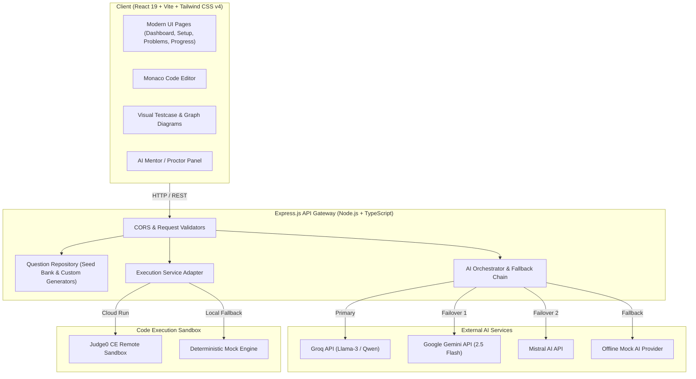
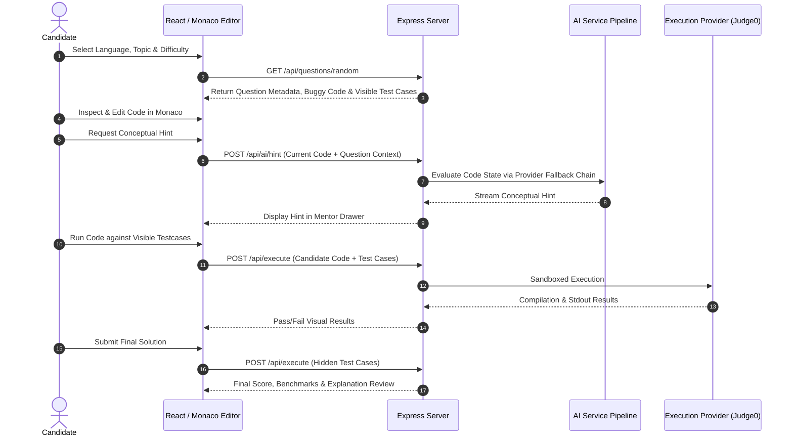

# ⚡ DebugLab — AI-Assisted Coding & Debugging Assessment Platform

<div align="center">

[](https://react.dev/)
[](https://www.typescriptlang.org/)
[](https://tailwindcss.com/)
[](https://nodejs.org/)
[](https://microsoft.github.io/monaco-editor/)
[](https://groq.com/)
[](https://judge0.com/)

**A high-performance, developer-centric assessment and practice platform designed to simulate corporate technical evaluations (such as Capgemini Stage 3 Debugging Rounds) and competitive algorithmic challenges across C, C++, Java, and Python.**

[Key Features](#-key-features) • [System Architecture](#-system-architecture) • [Tech Stack](#-tech-stack) • [Repository Structure](#-repository-structure) • [Getting Started](#-getting-started) • [API Documentation](#-api-documentation) • [Security](#-security--sandboxing)

</div>

---

## 📌 Overview

**DebugLab** is an enterprise-grade training and assessment engine that bridges the gap between traditional competitive coding and realistic software debugging. In modern technical assessments, candidates are frequently challenged not merely to write algorithms from scratch, but to **inspect buggy implementations, isolate logic regressions, rectify edge cases, and validate runtime constraints under strict proctored timers.**

DebugLab provides an immersive browser-based IDE coupled with an intelligent multi-model AI proctor/mentor, interactive data structure visualization, and sandboxed remote code execution.

---

## ✨ Key Features

### 1. Dual Practice & Assessment Suites
* **Debugging Assessment Trainer (`/workspace`)**:
  * Practice isolating and resolving pre-injected bugs across **C, C++, and Java**.
  * Covers core to advanced DSA: **Arrays, Strings, HashMaps, Binary Trees, BSTs, Graphs, 1D/2D Dynamic Programming, and Recursion**.
  * Structured 4-phase debugging methodology: `Review` &rarr; `Identify` &rarr; `Fix` &rarr; `Validate`.
* **Coding Assessment Hub (`/coding`)**:
  * Standard DSA problem-solving environment supporting **Python, C, C++, and Java**.
  * Complete starter templates, visible test cases, and hidden benchmark suites.

### 2. Intelligent Multi-Model AI Orchestrator
* **Resilient Failover Architecture**: Automatic provider fallback chain:
  $$\text{Groq (Ultra-low latency)} \longrightarrow \text{Google Gemini} \longrightarrow \text{Mistral AI} \longrightarrow \text{Local Mock}$$
* **Dual Proctoring Modes**:
  * **Practice Mode (AI Mentor)**: Provides real-time code analysis, progressive conceptual hints, algorithmic complexity guidance, and edge-case reminders without giving away the direct answer.
  * **Exam Mode (Proctor Mode)**: Strict assessment compliance. Restricts AI to compiler error explanation and system troubleshooting, strictly prohibiting solution leaks.

### 3. Integrated Monaco Code Workspace
* Full VS Code editor experience in the browser (syntax highlighting, line error markers, code folding, auto-formatting).
* Theme-customized for dark-mode productivity (`#0b0f19` obsidian aesthetic).
* Real-time diff comparison between initial buggy implementation and current candidate code.

### 4. Interactive Data Structure & Testcase Visualizer
* Dynamic SVG/Canvas visual diagram rendering for complex questions (Trees, Linked Lists, Graphs, Matrix grids, and 2D DP tables).
* Visual test case state inspection (Input, Expected Output, Actual Output, Diff Inspector).

### 5. Sandboxed Code Execution
* Pluggable execution architecture supporting **Judge0 RapidAPI** for authenticated cloud compilation/execution.
* Built-in zero-dependency **Mock Execution Provider** for instant offline practice, testing, and CI/CD demonstration.

### 6. Analytics & Assessment Metrics
* Anti-cheat timers calculated from server/timestamp offsets to prevent browser tab throttling.
* Post-submission diagnostic reports: time spent, bug classification accuracy, test case pass percentages, and optimal solution benchmarks.
* Client-side persistent attempt history and progress analytics.

---

## 🏛 System Architecture

The application adopts a decoupled, secure client-service architecture designed to isolate client interactions, protect private API credentials, and allow seamless interchangeability of execution and LLM backends.



### Request & Debugging Flow



---

## 💻 Tech Stack

### Frontend
| Component | Technology | Description |
| :--- | :--- | :--- |
| **Framework** | [React 19](https://react.dev/) | Modern concurrent UI architecture |
| **Build Tool** | [Vite 8](https://vitejs.dev/) | Ultra-fast HMR and production bundling |
| **Language** | [TypeScript 5](https://www.typescriptlang.org/) | Strict type safety and autocompletion |
| **Styling** | [Tailwind CSS v4](https://tailwindcss.com/) | Next-generation utility-first styling |
| **Code Editor** | [Monaco Editor](https://microsoft.github.io/monaco-editor/) | Desktop VS Code editing engine in browser |
| **Icons** | [Lucide React](https://lucide.dev/) | Consistent, lightweight vector icon suite |
| **Routing** | [React Router 7](https://reactrouter.com/) | Declarative client-side routing |
| **Linting** | [Oxlint](https://oxc.rs/) | High-speed JavaScript/TypeScript linter |

### Backend
| Component | Technology | Description |
| :--- | :--- | :--- |
| **Runtime** | [Node.js](https://nodejs.org/) (v18+) | Server-side JavaScript runtime |
| **Framework** | [Express 4](https://expressjs.com/) | Modular REST API service |
| **Language** | [TypeScript 5](https://www.typescriptlang.org/) | End-to-end type safety |
| **AI Integration** | REST HTTP Adapters | Multi-provider fallback (Groq, Gemini, Mistral) |
| **Code Execution** | Judge0 API Adapter | Isolated multi-language compilation & execution |
| **Dev Server** | `ts-node-dev` | Automatic TypeScript reload during development |

---

## 📂 Repository Structure

```text
ai-assisted-coding-and-debugging-assessment/
├── .env.example                     # Root environment template (sanitized)
├── .gitignore                        # Global Git ignore definitions
├── README.md                         # Project documentation and architectural overview
├── PRD.md                            # Product Requirements Document
├── architecture.md                   # Architectural specifications and design decisions
├── design.md                         # UI/UX design specifications
│
├── client/                           # Frontend React Application
│   ├── public/                       # Static public assets and SVGs
│   ├── src/
│   │   ├── assets/                   # Images and branding illustrations
│   │   ├── components/               # Reusable UI components
│   │   │   ├── AIAssistantPanel.tsx  # Interactive AI mentor sidebar
│   │   │   ├── BackgroundGrid.tsx    # Cybernetic obsidian background
│   │   │   ├── CodingAIPanel.tsx     # Coding assessment AI proctor
│   │   │   ├── Header.tsx            # Sticky frosted navigation bar
│   │   │   └── VisualDiagram.tsx     # Dynamic tree/graph/array visualizer
│   │   ├── pages/                    # Routed application views
│   │   │   ├── Dashboard.tsx         # User overview & quick launch
│   │   │   ├── Problems.tsx          # Comprehensive problem catalog
│   │   │   ├── PracticeSetup.tsx     # Debugging assessment configuration
│   │   │   ├── Workspace.tsx         # Main debugging IDE & testbench
│   │   │   ├── Results.tsx           # Debugging performance breakdown
│   │   │   ├── CodingSetup.tsx       # Coding challenge setup
│   │   │   ├── CodingWorkspace.tsx   # Coding editor workspace
│   │   │   ├── CodingResults.tsx     # Coding submission analysis
│   │   │   ├── Progress.tsx          # Analytics & mastery curves
│   │   │   └── Settings.tsx          # Provider & execution configuration
│   │   ├── types/                    # Shared frontend TypeScript interfaces
│   │   ├── App.tsx                   # Main route configuration
│   │   ├── index.css                 # Global CSS variables & Tailwind imports
│   │   └── main.tsx                  # React DOM entry point
│   ├── .oxlintrc.json                # Oxlint configuration
│   ├── package.json                  # Frontend dependencies and scripts
│   └── vite.config.ts                # Vite build and proxy settings
│
├── server/                           # Backend API Server
│   ├── src/
│   │   ├── app.ts                    # Express entry point & middleware
│   │   ├── routes/                   # REST routing definitions
│   │   │   ├── aiRoutes.ts           # AI hint, explanation, and proctor routes
│   │   │   ├── codingRoutes.ts       # Coding problem endpoints
│   │   │   └── questionRoutes.ts     # Debugging question endpoints
│   │   ├── services/
│   │   │   ├── ai/                   # AI Provider Adapters
│   │   │   │   ├── aiProvider.ts     # Generic provider interface
│   │   │   │   ├── groqProvider.ts   # Groq API integration
│   │   │   │   ├── geminiProvider.ts # Google Gemini API integration
│   │   │   │   ├── mistralProvider.ts# Mistral AI integration
│   │   │   │   ├── mockAIProvider.ts # Offline deterministic provider
│   │   │   │   ├── aiService.ts      # Multi-provider fallback orchestrator
│   │   │   │   └── codingAIService.ts# Coding assessment assistant
│   │   │   ├── execution/            # Code Execution Sandbox Adapters
│   │   │   │   ├── executionProvider.ts       # Common execution interface
│   │   │   │   ├── codingExecutionProvider.ts # Coding runner adapter
│   │   │   │   └── mockExecutionProvider.ts   # Offline mock execution engine
│   │   │   ├── questionRepository.ts # Question loader and filtering
│   │   │   └── codingQuestionRepository.ts
│   │   ├── validators/               # Request payload validation logic
│   │   ├── types/                    # Backend TypeScript models
│   │   ├── data/                     # Seed question datasets & visual scripts
│   │   │   ├── questions.json        # Curated debugging questions database
│   │   │   ├── codingQuestions.ts    # Algorithmic challenge repository
│   │   │   └── *.py                  # Bank generators and diagram scripts
│   │   └── tests/                    # Integration and unit tests
│   ├── .env.example                  # Server environment configuration template
│   ├── package.json                  # Backend dependencies and scripts
│   └── tsconfig.json                 # Backend TypeScript compiler configuration
│
└── docs/                             # Curated interview question references
    └── DSA_Interview_75_Questions.md # 75 high-frequency technical interview questions
```

---

## 🚀 Getting Started

### Prerequisites
* **Node.js**: v18.0.0 or higher
* **npm**: v9.0.0 or higher

### 1. Clone the Repository
```bash
git clone https://github.com/<your-username>/<your-repo-name>.git
cd "AI-Assisted Coding and Debugging Assessment"
```

### 2. Environment Configuration
Create the server environment file from the sanitized template:
```bash
# In the repository root:
cp .env.example server/.env
```

Open `server/.env` and optionally configure your API keys:
```env
PORT=5000

# AI Provider Selection: 'groq' | 'gemini' | 'mistral' | 'mock'
AI_PROVIDER=mock
AI_FALLBACK_ORDER=groq,gemini,mistral

# (Optional) Cloud AI API Keys:
GROQ_API_KEY=your_groq_api_key_here
GROQ_MODEL=qwen/qwen3.8-27b

GEMINI_API_KEY=your_gemini_api_key_here
GEMINI_MODEL=gemini-2.5-flash

MISTRAL_API_KEY=your_mistral_api_key_here
MISTRAL_MODEL=mistral-small-latest

# Code Execution Engine: 'judge0' | 'mock'
EXECUTION_PROVIDER=mock
JUDGE0_API_URL=https://judge0-ce.p.rapidapi.com
JUDGE0_API_KEY=your_rapidapi_key_here
```
> **Tip:** By leaving `AI_PROVIDER=mock` and `EXECUTION_PROVIDER=mock`, the application runs **100% offline** without requiring any paid third-party API keys!

### 3. Install & Start Backend Server
```bash
cd server
npm install
npm run dev
```
The server will boot on `http://localhost:5000`. Test health status at `http://localhost:5000/api/health`.

### 4. Install & Start Frontend Client
Open a separate terminal:
```bash
cd client
npm install
npm run dev
```
The client Vite dev server will start at `http://localhost:5173`.

---

## 📡 API Documentation

| Method | Endpoint | Description | Request Body / Parameters |
| :--- | :--- | :--- | :--- |
| `GET` | `/api/health` | Healthcheck confirmation | None |
| `GET` | `/api/questions` | List all available questions | `?language=cpp&topic=graphs&difficulty=medium` |
| `GET` | `/api/questions/:id` | Fetch specific question details | Route parameter `id` |
| `GET` | `/api/questions/random` | Retrieve random question by criteria | `?language=java&topic=trees` |
| `POST`| `/api/questions/execute`| Run code against visible test cases | `{ code, language, stdin, expectedOutput }` |
| `POST`| `/api/questions/submit` | Validate code against hidden tests | `{ questionId, language, code, userDiagnosis }` |
| `POST`| `/api/ai/hint` | Generate contextual Socratic hint | `{ questionId, currentCode, language, bugType }` |
| `POST`| `/api/ai/explain` | Generate comprehensive bug review | `{ questionId, buggyCode, correctedCode }` |
| `GET` | `/api/coding/questions`| List algorithmic coding problems | `?topic=dp&difficulty=hard` |
| `POST`| `/api/coding/execute`  | Run coding submission sandbox | `{ code, language, testCases }` |

---

## 🔒 Security & Sandboxing

1. **Zero Secret Leakage**: All AI tokens (Groq, Gemini, Mistral) and Judge0 credentials reside strictly on the Express backend server. They are never exported to frontend bundles or exposed in Vite client variables.
2. **Safe Code Execution**: Arbitrary user submissions are evaluated through sandboxed Judge0 workers or deterministic mock runners. Code is **never** executed on the host server via unisolated `child_process`.
3. **Defense-in-Depth Git Policy**: Both root and module-level `.gitignore` configurations prevent accidental commits of local `.env` files, build directories (`dist`), dependencies (`node_modules`), or binary caches.

---

## 🧪 Testing & Code Quality

* **Client Production Build**:
  ```bash
  cd client && npm run build
  ```
* **Client Linter (`oxlint`)**:
  ```bash
  cd client && npm run lint
  ```
* **Server Unit Tests**:
  ```bash
  cd server && npm test
  ```

---

## 🗺 Roadmap

- [x] Phase 1: Core debugging trainer, Monaco workspace, seed question banks.
- [x] Phase 2: Resilient multi-provider AI orchestrator with automated failover.
- [x] Phase 3: AI-Assisted coding challenge hub and visual testcase rendering.
- [ ] Phase 4: MongoDB Atlas persistence for multi-device profile and attempt synchronization.
- [ ] Phase 5: Peer-to-peer real-time collaborative debugging battles via WebSockets.

---

## 📄 License

This project is licensed under the [ISC License](LICENSE).
